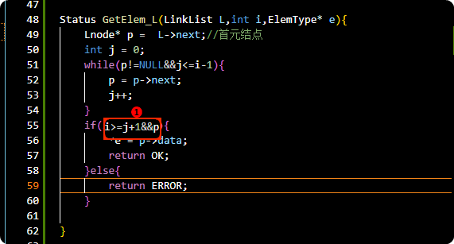

- 线性表的定义和特点
  collapsed:: true
	- 线性表的定义?
	  collapsed:: true
		- 由大于的等于0个的数据元素（节点）a<sub>1</sub>,a<sub>2</sub>,....,a<sub>n</sub> 组成的优先序列
		- 
		- 
	- 当 **n=0** 称为空表
	- 线性表的特点 ?
	  collapsed:: true
		- 1. 同一线性表中元素必定具有**相同特性**
		  2.  数据元素之间的关系是**线性关系**
		  3. 线性表具有唯一的**根节点**与**最后一个**节点
		  4. 除根节点外，均有一个**直接前驱**
		  5. 除最后一个节点外，均有一个**直接后继**
	- 线性表的顺序表示和实现
		- 顺序存储的定义?
		  collapsed:: true
			- 把逻辑上相邻的数据元素存储在物理上相邻的存储单元中的存储结构
			- 逻辑顺序与物理顺序相同
			- 占用一片连续的存储空间
			- 
		- 线性表顺序存储的基地址定义?
		  collapsed:: true
			- 线性表的第1个数据元素a1的存储位置
		- 顺序存储结构的寻址公式?
		  collapsed:: true
			- 
		- 随机存储的概念?
		  collapsed:: true
			- 计算地址只算一次与处理数据的[[$red]]==规模无关==，数量级是O(1)这种运算叫随机存取
		- 线性表长度与数组长度?
		  collapsed:: true
			- 1. 数组长度，线性表最多可容纳数据元素的个数
			  2. 线性表长度(length)：当前数据元素个数
		- 其中数组长度和线性表长度都是可变的|F
		  collapsed:: true
			- 1. 线性表长度是可变的
			  2. 数组长度不可动态变化
			  3.
		- 数组的定义方式？
		  collapsed:: true
			- 静态定义?
			  collapsed:: true
				- 
			- 动态定义?
			  collapsed:: true
				- 
				- 别忘了释放指针
		- 初始化线性表思路 on 动态定义?
		  collapsed:: true
			- 1. 线性表中数组成员，指向新开辟空间的基地址
			  2. 线性表长度设为0
		- [Q:初始化线性表实操 on 动态定义](quicker:///runaction:代码学习之旅B?C:\Users\Administrator\Documents\Mycode\DataStructures_zhuo|c70d10da315e2ec4efa02c491b52c74e873774bc) ?
		  collapsed:: true
			- [A:初始化线性表实操 on 动态定义](quicker:///runaction:代码学习之旅B?C:\Users\Administrator\Documents\Mycode\DataStructures_zhuo|f689688)
			- [A求线性表长度以及改正初始化代码](quicker:///runaction:代码学习之旅B?C:\Users\Administrator\Documents\Mycode\DataStructures_zhuo|b34cfef)
		- 求线性表长度代码?
		  collapsed:: true
			- [A求线性表长度以及改正初始化代码](quicker:///runaction:代码学习之旅B?C:\Users\Administrator\Documents\Mycode\DataStructures_zhuo|b34cfef)
		- 销毁线性表思路与实操
		  collapsed:: true
			- 1. 线性表存在
			  2. 释放空间
			  3.[顺序存储方式 销毁线性表](quicker:///runaction:代码学习之旅B?C:\Users\Administrator\Documents\Mycode\DataStructures_zhuo|f7bd38d)
		- 清空线性表思路？
		  collapsed:: true
			- 线性表的长度设置为0
			- [顺序存储方式 清空线性表](quicker:///runaction:代码学习之旅B?C:\Users\Administrator\Documents\Mycode\DataStructures_zhuo|0d5f873)
		- 线性表L中查找与给定值e相等的元素，若成功返回该元素在表中的序号，否则返回0思路?
		  id:: 633be474-dc40-449e-bc66-4c251fa54d7e
			- 1. 从表的一段开始
			  2. 逐个进行记录与给定值比较
			  3. 找到返回位置，否则返回0
			  4. [顺序存储方式 列表中是否有指定元素](quicker:///runaction:代码学习之旅B?C:\Users\Administrator\Documents\Mycode\DataStructures_zhuo|9ebe25c)
		- 顺序存储结构，线性表查找算法时间复杂度？
		  collapsed:: true
			- 将记录的关键字同给定值进行比较`(L.elem==e）`
			- 
			- [[$red]]==比较次数（C<sub>i</sub>）与输入值e(所查元素在表中位置)有关==
			- 设要比较值e出现的概率是1/7
			  当e = a, **1次**
			  当e=b，**2次**；
			  当e=c，**3次**；...
			  e=g,**7次**
			  平均比较次数为 **（1+2+3+.....+7）/7**
			- 
			- 
		- 插入线性表思路?
			- 1. 判断插入位置是否合法
			  2. 顺序表存储空间是否已满
			  3. 插入位置为i，**则将第n致i位置元素依次向后移动一个位置，空出第i位置**
			  4. 新插入元素e放到i位置上
			  5. 表长+1，返回OK
		- **第i个位置与第n个位置如何表示?
			- 
		- [Q 线性表的实操 顺序表方式](quicker:///runaction:代码学习之旅B?C:\Users\Administrator\Documents\Mycode\DataStructures_zhuo|cb73d0d) ?
			- A 就是上面的
		- 删除线性表L中递i个位置元素思路?
			- 1. 删除位置是否合法
			  2. 将预删除元素保留在e中
			  3. **将第i+1至n个元素依次向前移动**
		- 第i+1位置和第n位置如何表示?
			- 
			- [[#red]]==订正== for的循环条件中 条件是小于等于的
		- [Q 删除线性表L中递i个位置元素实操](quicker:///runaction:代码学习之旅B?C:\Users\Administrator\Documents\Mycode\DataStructures_zhuo|cb73d0d) ?
		  collapsed:: true
			- [A 删除线性表L中递i个位置元素实操 顺序表实现](quicker:///runaction:代码学习之旅B?C:\Users\Administrator\Documents\Mycode\DataStructures_zhuo|061a7f2)
		- 删除线性表L中递i个位置元素实操
		- 查看线性表是否为空方法?
			- ```C
			  int IsEmpty(Sqlist L){
			  	if(L.length == 0){
			  		return 1;
			  	}else{
			  		return 0;
			  	}
			  
			  }
			  ```
		- 返回线性表第i个位置的元素思路?
			- 1. 判断位置i合法
			  2. 数组随机存储方法即可
			  3. [顺序存储方式 获取指定位置的元素](quicker:///runaction:代码学习之旅B?C:\Users\Administrator\Documents\Mycode\DataStructures_zhuo|5105552)
		-
- 线性表的链式表示和实现
	- 相关概念定义
		- 链式存储的定义?
		  collapsed:: true
			- 1. 链式存储结构
			  2. 
		- 链表中节点的概念?
			- 1. 数据元素的存储映像
			  2. 由指针域和数据域构成
			  
		- 数据域的作用?
			- 存储数据
		- 指针域的作用?
			- 存储线性表中[[$red]]==下一个元素的地址==
		- 链表中链表的概念?
			- n个节点由指针链组成的链表
		- 链表中头指针概念?
		  collapsed:: true
			- 链表中第一个节点的存储位置
		- 单链表可用**头指针**的名字来命名
		- 线性表使用链式存储结构在内存中的表现形式是？
		  collapsed:: true
			- 1. 即使逻辑上相连的两个元素，**在内存中不一定相邻**
			  2. 连不连续都可
		- 链表中元素的逻辑次序和物理次序是相同的|F
		- 带头节点单链表示意图?
			- 
		- 单链表的概念?
			- 节点只有一个指针域的链表
			- 
		- 双链表的概念?
			- 节点有两个指针域的链表
			- 
		- 循环链表的概念?
			- 首尾相连的链表称为循环链表
			- 
		- 分别指出下面图片中哪个节点是头结点、首元结点以及头指针 ?
		  collapsed:: true
			- 
		- 请画出带头节点的示意图?
			- 
		- 请画出不带头节点的示意图?
			- {:height 159, :width 580}
		- 单链表-无头结点：空链示意图?
			- 
		- 单链表-带头结点：空链示意图?
			- {:height 135, :width 212}
		- 单链表-无头结点：非空链示意图?
			- 
		- 单链表-头结点：非空链示意图?
			- 
		- 头结点的数据域可以为空，可存放**线性表长度**等附加信息，但此结点不能计入链表长度值。
		- 链表（链式存储的特点）?
			- 物理次序和逻辑次序不一定相同
			- 访问时，必须通过头指针开始，依次访问后续节点。
		- 顺序存取的概念，**从头开始依次访问**
	- 单链表的基本操作
	  collapsed:: true
		- code:定义单链表节点?
		  collapsed:: true
			- 
			- 习惯上用LinkList 定义单链表，强调的是单链表的头指针
			- Lnode 定义指向任意节点的指针变量
			- <a href="quicker:runaction:代码学习之旅B?C:\Users\Administrator\Documents\Mycode\DataStructures_zhuo|836a750">QA单链表 结构定义</a>
		- code:实现单链表的初始化?
		  collapsed:: true
		  id:: 633a3e87-e5ee-43cf-82fd-677d2d8cfebc
			- <a href="quicker:runaction:代码学习之旅B?C:\Users\Administrator\Documents\Mycode\DataStructures_zhuo|836a750">Q 实现单链表的初始化</a>
			- <a href="quicker:runaction:代码学习之旅B?C:\Users\Administrator\Documents\Mycode\DataStructures_zhuo|fa799ce">A 实现单链表的初始化</a>
		- code:实现判断带头单链表是否为空?
		  collapsed:: true
			- <a href="quicker:runaction:代码学习之旅B?C:\Users\Administrator\Documents\Mycode\DataStructures_zhuo|d03f7b8">Q 实现判断带头单链表是否为空</a>
			- <a href="quicker:runaction:代码学习之旅B?C:\Users\Administrator\Documents\Mycode\DataStructures_zhuo|901fa5d">A 实现判断带头单链表是否为空</a>
			  id:: 633a3e87-51ea-42a9-8363-cc80eb2efc2f
		- idea:销毁带头单链表?
		  collapsed:: true
			- 从头指针开始?
			  collapsed:: true
				- Lnode* p = L:头指针
			- 依次释放所有节点?
			  collapsed:: true
				- L = L->next;
				- 
			- 循环条件: **L!=NULL**
		- code:销毁带头节点单链表?
		  id:: 6336648b-4bfb-45b0-a72e-4ceb13c52c40
		  collapsed:: true
			- <a href="quicker:runaction:代码学习之旅B?C:\Users\Administrator\Documents\Mycode\DataStructures_zhuo|783808b">QA销毁带头节点单链表</a>
		- idea:清空单链表中的节点?
		  collapsed:: true
			- 从头结点后开始(即首元结点开始)?
			- 依次释放所有节点?
			- 头结点指针域设置为空?
		- code:清空单链表中的所有节点 Status ClearList?
		  collapsed:: true
			- {:height 248, :width 638}
			- 
			- <a href="quicker:runaction:代码学习之旅B?C:\Users\Administrator\Documents\Mycode\DataStructures_zhuo|894cd83">QA清空单链表中的所有节点</a>
		- idea:求单链表L的表长：带头节点？
		  collapsed:: true
			- 从头结点后面的节点即首元结点开始
			- 依次计数所有节点
			- 
		- code:求单链表L的表长：带头节点?
		  id:: 633a3e87-b3ef-4764-b0a1-1a780d41ba75
		  collapsed:: true
			- ```C
			  int ListLength_L(LinkList L)
			  {
			  	LinkList p;
			  	int i;
			  	
			  	if(L)
			  	{
			  		i = 0;
			  		p = L->next;
			  		while(p)
			  		{
			  			i++;
			  			p = p->next;
			  		}		
			  	}
			  	
			  	return i;
			  }
			  ```
			- 下面的求单链表表长的代码是否正确
			  collapsed:: true
			  |F
				- LinkList 是 Lnode*类型的指针
				- L 是一个指针 作为游标的时候，L 指针，指向的内容发生改变了
		- idea:取单链表中第i个元素的内容：带头结点?
			- j做计数器 从首元结点（**L->next**）顺联扫描
			- 每扫描一个节点，计数器+1，j==i时候结束
				- 下图中while循环的循环条件是什么  ?
					- 
					- [[#red]]==订正==  j < i-1
				- 下图中if循环的条件是什么
				  collapsed:: true
				   ?
					- 
		- <a href="quicker:runaction:代码学习之旅B?C:\Users\Administrator\Documents\Mycode\DataStructures_zhuo|5eb1156">code:取单链表中递i个元素的内容：带头节点?</a>
		  collapsed:: true
			- <a href="quicker:runaction:代码学习之旅B?C:\Users\Administrator\Documents\Mycode\DataStructures_zhuo|5647be8">A code:取单链表中递i个元素的内容：带头节点?</a>
		- <a href="quicker:runaction:代码学习之旅B?C:\Users\Administrator\Documents\Mycode\DataStructures_zhuo|d6d49bd">idea:按值查找-根据指定数据获取改数据所在位置（地址）?</a>
		  collapsed:: true
			- 首元结点开始依次和e比较
			  collapsed:: true
				- 从首元结点开始的原因是 **头结点不存储数据，不作为查找结果**
			- 找到返回其在链表中的“位置”或地址
			- 若整个链表都没找到，返回0或NULL
			- 下面代码中while条件内填写什么代码
			  collapsed:: true
			   ?
				- 答案： 
				-
		- <a href="quicker:runaction:代码学习之旅B?C:\Users\Administrator\Documents\Mycode\DataStructures_zhuo|d6d49bd">code:按值查找-根据指定数据获取改数据所在位置（地址）?</a>
			- <a href="quicker:runaction:代码学习之旅B?C:\Users\Administrator\Documents\Mycode\DataStructures_zhuo|e47cbbe">A code:按值查找-根据指定数据获取改数据所在位置（地址）?</a>
		- code:按值查找-根据指定数据获取该数据位置序号?
		  collapsed:: true
			- <a href="quicker:runaction:代码学习之旅B?C:\Users\Administrator\Documents\Mycode\DataStructures_zhuo|ae59761">A code:按值查找-根据指定数据获取该数据位置序号?</a>
		- idea:在第i个节点前插入值为e的新节点?
		  id:: 633a4758-4f3c-445c-ab56-2e45eafe9a22
			- 先找到i-1位置的节点 p
			- 
			- 下面1里面的内容的顺序是否可以更换  ?
				- 
				- 不可以，会造成a<sub>i</sub>的节点丢失
			-
		- <a href="quicker:runaction:代码学习之旅B?C:\Users\Administrator\Documents\Mycode\DataStructures_zhuo|b5fcd4f">Qcode:在第i个节点前插入值为e的新节点?</a>
		  collapsed:: true
			- <a href="quicker:runaction:代码学习之旅B?C:\Users\Administrator\Documents\Mycode\DataStructures_zhuo|1c47dbe">A code:在第i个节点前插入值为e的新节点?</a>
		- idea:删除第i个节点?
		  collapsed:: true
			- 找到a_{i-i} 的位置p
			- 令p的指针域 指向 a_{i+1}
			- 释放节点a_{i}
			- 
		- <a href="quicker:runaction:代码学习之旅B?C:\Users\Administrator\Documents\Mycode\DataStructures_zhuo|4a28b99">Qcode:删除第i个节点</a>?
			- <a href="quicker:runaction:代码学习之旅B?C:\Users\Administrator\Documents\Mycode\DataStructures_zhuo|a0156ef">Acode:删除第i个节点?  </a>
		- 单链表插入算法的时间复杂度是**O{n}**
		- 单链表查找算法的时间复杂度是**O{n}**
		- 单链表删除算法的时间复杂度是**O{n}**
		- idea：使用头插法建立单链表?
		  collapsed:: true
			- 从建立一个空表开始
			- 重复生成新节点，装入数据，插入到头结点后（表头）
			- 
		- code：使用头插法建立单链表?
		  collapsed:: true
			- 
			-
		- idea：使用尾插法建立单链表?
		  collapsed:: true
			- 从新建空表L开始，尾指针r指向链表的尾结点
			- 将新节点逐个插入链表尾部（插入的同时尾结点r:指向**重新指向尾结点**）
			- 
		- Qcode：使用尾插法建立单链表?
			- 
	- 循环链表：概念  是**头尾相接的链表（即表中最后一个结点的指针域指向头结点 ）**
	- 单向循环链表空表示意图?
		- 
	- 非空单向循环链表示意图?
	  collapsed:: true
		- 
	- 单向循环链表的优点?
	  collapsed:: true
		- 从表中任一结点出发均可访问全部结点
	- 非循环单链表中，做遍历操作时，终止条件为 **p 或p->next 是否为空**
	- 循环单链表中，做遍历操作时，循环条件为 **p!=L 或 p->next != L**
	- idea:带尾指针循环单链表的合并（将Tb合并在Ta之后):带头节点 {:height 238, :width 585}？
	  collapsed:: true
		- **存Ta的表头节点:why要存**?
		  collapsed:: true
			- 要留有备用，后续Tb->next = Ta的表头节点
			- p= Ta->next
		- **Tb的寿元节点链接的Ta的表尾**
		  collapsed:: true
			- Ta->next = Tb->next->next;
		- **释放Tb的头结点**
		  collapsed:: true
			- delete Tb->next
		- **修改Tb->next为Ta的头结点**
		  collapsed:: true
			- Tb->next = p;
	- code:带尾指针循环单链表的合并（将Tb合并在Ta之后）
		- 
	- 双向循环链表节点结构示意图?
		- 
	- 双向循环链表节点结构代码实现 C语言:DulNode?
		- 
	- 双向循环链表的非空示意图:带头结点?
		- {:height 144, :width 488}
	- 双向循环链表的为空示意图:带头结点?
		- 
	- 双向链表结构有对称性(设指针p指向某一个结点)?
	  collapsed:: true
		- p->prior->next=p=p->next->prior(前进一步后退一步相当于原地踏步)
		  
	- idea:双向链表的插入?
	  collapsed:: true
		- 找到节点p
		- 用p->prior 代表p的前一个节点
		- 则 先接新节点s与p的前一个节点
		- 在接s与p节点
		- 
	- code:双向链表的插入?
		- {:height 34, :width 207}
	- 双向链表插入与 [单链表插入](((633a4758-4f3c-445c-ab56-2e45eafe9a22)))  的对比?
		- [[$red]]==通过谁找到谁?== 这个通过p 找到 a 所以[[#red]]==先操作（接上）"非直接"的==
	- code:双向链表的删除 ?
	  collapsed:: true
		- 
		-
	- 单链表、循环链表和双向链表的时间效率比较
	  collapsed:: true
		- 填空
		  ?
			- 
		- 填空
		  collapsed:: true
		  ?
			- 
			-
		- 填空
		  collapsed:: true
		  ?
			- 
		- 填空
		  collapsed:: true
		  ?
			- 
	- 存储密度概念?
	  collapsed:: true
		- 数据本身占用的空间除以节点占用的空间总量
		- 
	- 怎么选择线性表的存储结构
		- 从存储角度来说?
		  collapsed:: true
			- 
		- 从效率角度说
		  collapsed:: true
		   ?
			- 
		- 基于存储原理说
		  collapsed:: true
		  ?
			- {:height 241, :width 433}
- 线性表的应用
  collapsed:: true
	- idea:假设利用两个线性表La和Lb分别表示两个集合A,B，现要求一个新的集合A=A∪B 
	  collapsed:: true
	  La=(7,5,3,11)Lb=(2,6,3)A=(7,5,3,11,2,6)?
		- 依次(需要循环)取出Lb中的每个元素
		- 在La中查找该元素如果没有插入到La表尾
	- 伪代码:假设利用两个线性表La和Lb分别表示两个集合A,B，现要求一个新的集合A=A∪B 
	  collapsed:: true
	  La=(7,5,3,11)Lb=(2,6,3)A=(7,5,3,11,2,6)?
		- 
	- idea:顺序表实现 已知线性表La和Lb中的数据元素按值非递减有序排列，现要求将La和Lb归并为一个新的线性表Lc且Lc中的数据元素按值非递减有序排列(不一定是严格递增的可能出现相等的元素) La=(1,7,8)Lb=(2,4,6,8,10,11)A=(1,2,4,6,7,8,8,10,11) ?
	  collapsed:: true
		- 创建一个空表Lc
		- 依次从La或Lb中，“摘取” 元素值小的节点差插入到Lc表后
		- 直到其中一个表为空
		- 将La或Lb某一表的剩余节点插入Lc表最后
	- code:顺序表实现 已知线性表La和Lb中的数据元素按值非递减有序排列，现要求将La和Lb归并为一个新的线性表Lc且Lc中的数据元素按值非递减有序排列(不一定是严格递增的可能出现相等的元素) La=(1,7,8)Lb=(2,4,6,8,10,11)A=(1,2,4,6,7,8,8,10,11) ?
	  collapsed:: true
		- 语法填空 ?
		  collapsed:: true
			- 
		- 语法填空 ?
			- 
	- idea:链表实现 将两线性表La，Lb合成一个按值非递减有序排列集合Lc?
	  collapsed:: true
		- 需要La、Lb、Lc指针指向三个链表、需要pa、pb、pc三个"游标指针"
		- 
		- 比较大小 1<2  则 pa指向的节点插入到pc后，且移动pa游标到La的下一个节点
		- Lc的游标移动到pa游标所指的位置上。
		- 直到一个链表中所有元素查到Lc中
		- ps Lc的路径可以看做成蜘蛛织网 
	- code:链表实现 将两线性表La，Lb合成一个按值非递减有序排列集合Lc?
	  collapsed:: true
		- 
	-
-